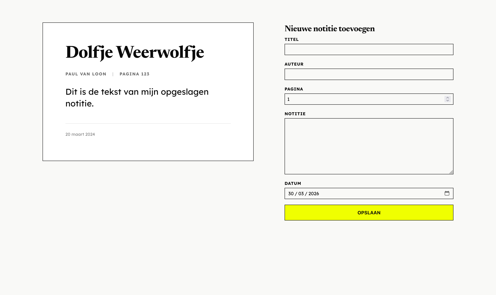

> [!WARNING]
> Dit project is gemaakt voor een (half) blind persoon, de opdracht was om het alleen werkend te krijgen voor specifiek diegene.

## Leerdoelen bij deze opdracht

- [Leerdoel 1]
    - [Beschrijving van wat je wilt leren en bouwen]
    - *Reden: [Waarom is dit belangrijk voor je ontwikkeling?]*

- [Leerdoel 2]
    - [Beschrijving van wat je wilt leren en bouwen]
    - *Reden: [Waarom is dit belangrijk voor je ontwikkeling?]*

## Week 1

### Dag 1

#### Wat heb ik gedaan vandaag?

| Activiteit | Duur |
|------------|------|
| Kick-off van het vak | 2 uur |
| Brainstormen over het project | 2 uur |
| Basis gemaakt aan styling | 1 uur |
| Getest met screenreader | 1 uur |
| Pauze | 1 uur |

#### Wat heb ik geleerd?

* Als een date picker dd/mm/jjjj invoert, wordt er een percentage opgelezen, ik heb dit opgelost door de date picker input te veranderen naar de datum van vandaag
* Hoe je een website toegankelijk kan maken voor een screenreader door middel van een sr-only class met styling

#### Wat ga ik morgen doen?
- [ ] Testen met de gebruiker
- [ ] Aanpassingen doen op basis van feedback

### Dag 2

#### Testplan

| Stap | Wat ik Roger laat doen | Waar ik op ga letten (Pijnpunten) |
| :--- | :--- | :--- |
| **1. Invoeren** | Ik laat hem een korte notitie toevoegen. | Worden alle velden (zoals 'Pagina' en 'Datum') duidelijk voor hem gelabeld en voorgelezen? |
| **2. Opslaan** | Ik vraag hem op 'Opslaan' te drukken. | Krijgt hij feedback van de screenreader? Weet hij dat het gelukt is als de focus terugspringt? |
| **3. Terugvinden** | Ik laat hem de notitie in de lijst zoeken. | Kan hij navigeren via koppen (`H`)? Wordt metadata logisch voor hem voorgelezen? |

#### Testresultaten

#### Wat heb ik gedaan vandaag?

| Activiteit | Duur |
|------------|------|
| [Activiteit] | [Tijd] |

#### Wat heb ik geleerd?

* [Leerpunt 1]

#### Wat ga ik morgen doen?
- [ ] [Plan]

### Week 1 recap

#### Wat heb ik deze week gedaan?
[Korte samenvatting van de week]

#### Belangrijkste leerpunten
* [Punt 1]
* [Punt 2]

---

## Week 2

### Dag 1

#### Wat heb ik gedaan vandaag?

| Activiteit | Duur |
|------------|------|
| [Activiteit] | [Tijd] |

#### Wat heb ik geleerd?

* [Leerpunt]

#### Wat ga ik morgen doen?
- [ ] [Plan]

### Dag 2

#### Wat heb ik geleerd?

* [Leerpunt]

### Week 2 recap

#### Wat heb ik deze week gedaan?
[Korte samenvatting van de week]

#### Belangrijkste leerpunten
* [Punt]

---

## Week 3 

### Dag 1

| Activiteit | Duur |
|------------|------|
| [Activiteit] | [Tijd] |

#### Wat heb ik geleerd?

* [Leerpunt]

#### Wat ga ik morgen doen?
- [ ] [Plan]

### Dag 2

| Activiteit | Duur |
|------------|------|
| [Activiteit] | [Tijd] |

#### Wat heb ik geleerd?

* [Leerpunt]

#### Wat ga ik morgen doen?
- [ ] [Plan]

### Week 3 recap

#### Belangrijkste leerpunten
* [Punt]

---

## Week 4 

### Dag 1

| Activiteit | Duur |
|------------|------|
| [Activiteit] | [Tijd] |

### Eindreflectie

[Hier komt je eindreflectie. Wat heb je geleerd? Wat ging soepel? Wat was moeilijk?]

[Afbeelding van het eindresultaat]

---

## Bronnen en AI-verantwoording

### Externe bronnen
- [Bron 1]
- [Bron 2]

### AI-gebruik
- [AI tool (bijv. GitHub Copilot, ChatGPT)]

### Verantwoording AI-gebruik
[Leg hier uit hoe en waarom je AI hebt gebruikt tijdens dit project.]
- [Punt 1]
- [Punt 2]
- [Punt 3]