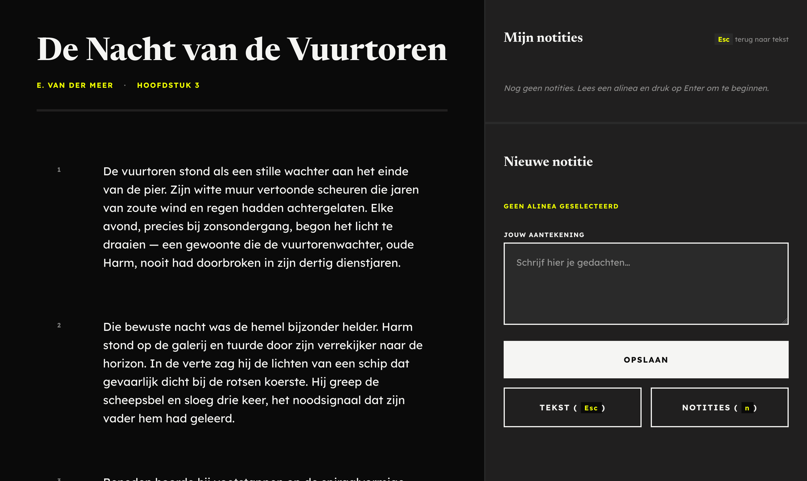
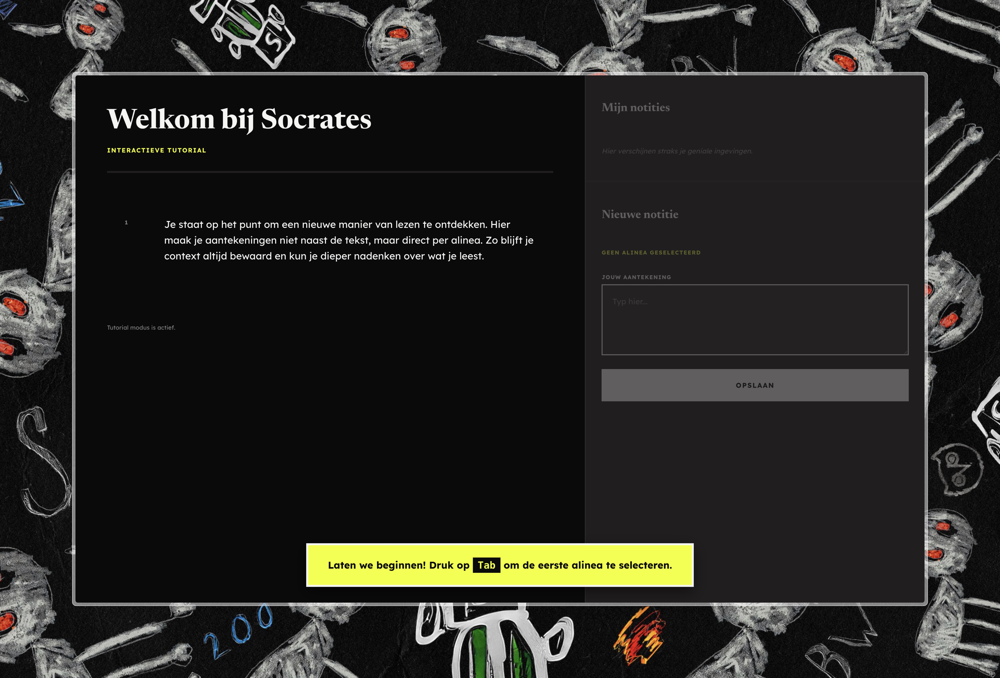

> [!WARNING]
> Dit project is gemaakt voor een (half) blind persoon, de opdracht was om het alleen werkend te krijgen voor specifiek diegene.

## Leerdoelen bij deze opdracht

- Ik wil een toegankelijke en responsive interface bouwen met semantische HTML, goede contrasten en duidelijke navigatie, zodat mijn projecten bruikbaar zijn op elk device.
  - _Reden: Accessibility en responsiveness zorgen voor inclusieve, gebruiksvriendelijke websites._

## Week 1

### Dag 1

#### Wat heb ik gedaan vandaag?

| Activiteit                    | Duur  |
| ----------------------------- | ----- |
| Kick-off van het vak          | 2 uur |
| Brainstormen over het project | 2 uur |
| Basis gemaakt aan styling     | 1 uur |
| Getest met screenreader       | 1 uur |
| Pauze                         | 1 uur |

#### Wat heb ik geleerd?

- Als een date picker dd/mm/jjjj invoert, wordt er een percentage opgelezen, ik heb dit opgelost door de date picker input te veranderen naar de datum van vandaag
- Hoe je een website toegankelijk kan maken voor een screenreader door middel van een sr-only class met styling

#### Wat ga ik morgen doen?

- [x] Testen met de gebruiker
- [x] Aanpassingen doen op basis van feedback

### Dag 2

#### Testplan

| Stap               | Wat ik Roger laat doen                     | Waar ik op ga letten (Pijnpunten)                                                              |
| :----------------- | :----------------------------------------- | :--------------------------------------------------------------------------------------------- |
| **1. Invoeren**    | Ik laat hem een korte notitie toevoegen.   | Worden alle velden (zoals 'Pagina' en 'Datum') duidelijk voor hem gelabeld en voorgelezen?     |
| **2. Opslaan**     | Ik vraag hem op 'Opslaan' te drukken.      | Krijgt hij feedback van de screenreader? Weet hij dat het gelukt is als de focus terugspringt? |
| **3. Terugvinden** | Ik laat hem de notitie in de lijst zoeken. | Kan hij navigeren via koppen (`H`)? Wordt metadata logisch voor hem voorgelezen?               |

#### Testresultaten

- 📖 Geen idee welke pagina die zit in een boek.
- 🌓 Prefereert dark mode
- 🎙️ Notities opnemen vond niet iedereen goed in een vergadering
- 💬 Whatsapp doet ie veel met spraak, (TTS). Stotteren hierbij is wel moeilijk
- ✅ Soms is de WCAG checklist niet voldoende
- 📄 Wilt liever iets in word dan een aparte website
- 💻 Wilt aantekeningen alleen op desktop maken
- 🖥️ NVDA en Supernova op desktop
- 📚 Aantekeningen per boek geordend
- ⌨️ Keybinds zijn goed maar moeten super duidelijk beschreven worden
- 🔍 Hoe kan je zoeken naar ee nbepaalde opmerking
- 🎤 Lezen is geen optie, echt met voiceover

#### Wat heb ik gedaan vandaag?

| Activiteit         | Duur    |
| ------------------ | ------- |
| Testen met Roger   | 2 uur   |
| Voorlichting stage | 2 uur   |
| Weekly geek        | 1,5 uur |

#### Wat heb ik geleerd?

-

#### Wat ga ik morgen doen?

- [x] API

### Week 1 recap

#### Wat heb ik deze week gedaan?

Ik heb de basis gemaakt voor de website met basisfunctionaliteit voor een notitie opslaan, voor de rest heb ik kennis gemaakt met Roger en geleerd hoe hij omgaat met het web

#### Belangrijkste leerpunten

- Hij is niet helemaal blind
- Prefereert dark mode

---

## Week 2

### Dag 1

#### Wat heb ik gedaan vandaag?

| Activiteit            | Duur  |
| --------------------- | ----- |
| Getest met Roger      | 2 uur |
| Weekly Geek           | 1 uur |
| Verbeteringen gemaakt | 5 uur |

#### Wat heb ik geleerd?

- Roger vindt mijn prototype geweldig

#### Wat ga ik morgen doen?

- [x] API

#### Testresultaten

- 📖 Geen apart lettertype
- ⌨️ Tabben per alinea is goed
- 🖊️ Moet notitie kunnen bewerken
- 📌 Markering toevoegen per alinea waar een annotatie bij hoort
- ⏭️ Na het maken van een notitie bij een stukje tekst door naar het volgende stuk tekst

### Week 2 recap

#### Wat heb ik deze week gedaan?

Je kan nu per alinea tabben naar verschillende stukken tekst, dan kan je met enter een notitie maken bij een alinea. Deze notitie wordt dan opgeslagen en je kan deze later terugvinden in de notities sectie. Ook heb ik de website dark mode gemaakt en een aparte lettertype toegevoegd.

Bij de feedback van vrijdag heb ik te horen gekregen dat de website meer persoonlijk kan, de reden dat hij soms over belangrijke elementen skipt is omdat het altijd gewoon dezelfde voiceover stem is die dezelfde saaie tekst vertelt.

#### Belangrijkste leerpunten

- Tabben per alinea werkt fantastisch

---

## Week 3

### Dag 1

#### Testresultaten

- 🔊 Instructies voor het maken van een notitie direct na de alinea zijn super duidelijk
- 🔤 Het weghalen van de notitie-emoji zorgt voor een veel rustigere voorleeservaring
- 🗣️ Een andere stem (of intonatie) voor notities/meldingen ten opzichte van gewone tekst helpt enorm
- 🔄 Na het opslaan van een notitie is het prettig dat de focus logisch terugspringt
- 🗑️ Snel kunnen verwijderen of bewerken van bestaande notities zonder de context kwijt te raken is gewenst

---

## Week 4

### Dag 1

| Activiteit                        | Duur  |
| --------------------------------- | ----- |
| Tutorial toegevoegd aan het begin | 6 uur |

### Dag 2

#### Testresultaten

- 🔊 Geluidjes kunnen een positieve toevoeging zijn, maar moeten wel duidelijk zijn
- 📖 De navigatie moet per hoofdstuk zijn, dus je moet snel van hoofdstuk naar hoofdstuk kunnen switchen
- 💬 Hij vindt de tutorial handig, alleen ik denk zelf dat de volgorde nogwel beter kan op sommige momenten

#### Wat heb ik deze week gedaan?

Er is nu een kleine tutorial aan het begin om Roger mee op weg te helpen. Hij vondt dit mega fijn werken. Ook heb ik wat meer persoonlijke elementen toegevoegd aan de website, zodat hij wat meer de specifieke keybinds doorheeft. Het installeren van een aangenamere stem vond hij bijvoorbeeld mega fijn haha.

#### Belangrijkste leerpunten

- Het type stem die je voor voiceover hebt maakt uit
- Focus verspringt nog niet goed na het maken van een notitie

### Eindreflectie

**Waarom dit werkt: De 4 principes van Exclusive Design**
Dit project is een praktijkvoorbeeld van [Exclusive Design](https://medium.com/@nadja_g_hodzic/exclusive-design-enhancing-accessibility-through-creativity-a25d7d2807fa). In plaats van de standaard 'Inclusive Design' regels te volgen, hebben we de principes toegepast op basis van de letterlijke feedback van Roger:

1. **Study situation (i.p.v. 'Consider all contexts')**
We ontwierpen niet voor elke situatie, maar puur voor de zijne. Uit de tests bleek direct dat hij aantekeningen uitsluitend op desktop wil maken en hierbij NVDA of Supernova gebruikt. Hoewel hij niet volledig blind is, is visueel lezen geen optie en gebruikt hij uitsluitend voice-over. Die context werd de enige waar we voor bouwden.

1. **Ignore conventions (i.p.v. 'Be consistent')**
Standaard web-navigatie werkte hier niet prettig. In plaats daarvan hebben we het zo gebouwd dat hij met "Tab" per alinea kan navigeren, wat hij erg goed vond werken. Omdat hij aangaf dat keybinds super duidelijk beschreven moeten worden, hebben we een kleine tutorial aan het begin toegevoegd om hem op weg te helpen (iets wat normaal vaak wordt weggelaten of verborgen in een "help" menu). Hij vond dit "mega fijn werken".

1. **Prioritise identity (i.p.v. 'Prioritise content')**
We hebben de applicatie aangepast op wie Roger is. Hij gaf in week 1 al aan dat hij dark mode prefereert, dus die is toegevoegd. Tijdens tests merkte hij ook op dat hij soms over belangrijke elementen skipt, simpelweg "omdat het altijd gewoon dezelfde voiceover stem is die dezelfde saaie tekst vertelt". Door de notitie-emoji weg te halen voor rust, en hem te helpen met het installeren van een aangenamere stem, werd de ervaring veel persoonlijker.

1. **Add nonsense (i.p.v. 'Add value')**
Niet alles draait om pure efficiëntie; in week 2 kregen we terug dat de website best "meer persoonlijk" mocht zijn. Hij gaf aan dat bijvoorbeeld geluidjes een positieve toevoeging kunnen zijn, zolang ze maar duidelijk blijven. Door wat meer persoonlijke elementen toe te voegen aan de website—zoals in de tutorial—hielpen we hem de specifieke keybinds beter te begrijpen en werd de algehele ervaring voor hem veel plezieriger.

Conclusie: Een toegankelijke applicatie bouw je niet vanuit een checklist. Je bouwt het door ernaast te zitten terwijl iemand probeert je interface blind te gebruiken.

---

## Bronnen en AI-verantwoording

### Externe bronnen

- Geen externe bronnen gebruikt voor complexe logica, voornamelijk MDN Web Docs voor referentie.

### AI-gebruik

- Google Antigravity (Gemini 3.1 Pro)

### Verantwoording AI-gebruik

Ik heb Google Antigravity gebruikt om me te helpen met complexe JavaScript logica en toegankelijkheid (accessibility) in mijn applicatie, met name voor screenreader focus management.

**Code bronnen in APA format:**

1. Google. (2026). *Google Antigravity* [Groot taalmodel]. https://gemini.google.com
   - **Gebruikt voor:** Notitie opslaan, bewerken, en focus management (`main.js`).
   - **Prompt:** "Ik wil notities opslaan, bewerken en verwijderen, maar de screenreader focus raakt telkens verdwaald als ik op opslaan klik. Hoe fix ik deze logica?"
   
2. Mozilla. (z.d.). *HTMLElement: dataset property - Web APIs | MDN*. Geraadpleegd op 6 mei 2026, van https://developer.mozilla.org/en-US/docs/Web/API/HTMLElement/dataset
   - **Gebruikt voor:** Het opslaan en uitlezen van het actieve alinea ID via data-attributen in `main.js`.
   
3. Mozilla. (z.d.). *aria-invalid - Accessibility | MDN*. Geraadpleegd op 6 mei 2026, van https://developer.mozilla.org/en-US/docs/Web/Accessibility/ARIA/Attributes/aria-invalid
   - **Gebruikt voor:** Toegankelijke validatie van de textarea wanneer deze leeg is in `main.js`.
   
4. Mozilla. (z.d.). *Element: scrollIntoView() method - Web APIs | MDN*. Geraadpleegd op 6 mei 2026, van https://developer.mozilla.org/en-US/docs/Web/API/Element/scrollIntoView
   - **Gebruikt voor:** Het direct scrollen naar de zojuist aangemaakte notitie in `main.js`.
